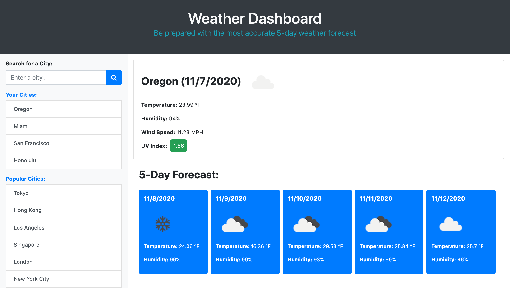

# Weather Dashboard Using The OpenWeather API

## Description

This week I learned that an API (application programming interface) allows one application to communicate to another. More importantly, a third-party API allows you to access a third parties functionality or data to use on your own site or application. An analogy that resonated most with me was to imagine an API as a waiter in a restaurant. Similarily to how a waiter is acts as the direct means of communication between a customer and the kitchen, and API acts as a messenger that listens for a user's request, and reponds by telling the system what to do and delivering the response back to the user.

It's always important to check the wheather forecast for your destination before you leave so that you are well prepared. Therefore, this weather dashboard is here to help you check the weather outlook for multiple cities so that they can plan a trip accordingly. This application runs in the browser and features dynamically updated HTML and CSS.

There are a variety of weather APIs freely available to use, however, I have used the [**OpenWeather API**](https://openweathermap.org/api). This third-party API gives us the advantage of not needing to constantly update the weather manually. Instead using JavaScript, we can pull weather data from the API into our weather dashboard application by making requests with specific parameters to a URL. Since developers are often tasked with retrieving data from another application and using it in the context of their own, it can be advantageous to use third-party API's.

### How the weather dashboard works

This is a weather dashboard with form inputs.

1. When a user wants to search for a city they will be presented with current and future conditions for that city and that city is added to their search history.
2. When a user views the current weather conditions for that city, they will be presented with the city name, the date, an icon representation of weather conditions, the temperature, the humidity, the wind speed, and the UV index.
3. When a user views the UV index, they are presented with a color that indicates whether the conditions are favorable, moderate, or severe
4. When a user views future weather conditions for that city, they are presented with a 5-day forecast that displays the date, an icon representation of weather conditions, the temperature, and the humidity.
5. When a user clicks on a city in their search history, they are again presented with the current and future weather conditions for that city.

### Mock-Up

The following animation shows the web application's appearance and functionality:

## Table of Contents

- [Installation](#installation)
- [Usage](#usage)
- [Credits](#credits)
- [License](#license)

## Installation

You'll need to use the [**OpenWeather API**](https://openweathermap.org/api) to retrieve weather data for cities. To get started using the API you will first need to [**sign up**](https://home.openweathermap.org/users/sign_up) with your email and you will get your API key (APPID) a the confirmation email. The [**API documentation**](https://openweathermap.org/api) is an essential guide with real examples and comprehensive description of API calls, responses and its parameters. The documentation also includes a section called "How to start" that provides basic setup and usage instructions for more clarity.

To install this project locally clone this [**project repository**](https://github.com/kaylamuraoka/Weather_Dashboard_With_OpenWeather_API) to create a local copy on your computer and sync between the two locations. You may then modify the code to your liking. For steps on how to clone a repository using the command line, read this section of the GitHub Docs [**about cloning a repository**](https://docs.github.com/en/free-pro-team@latest/github/creating-cloning-and-archiving-repositories/cloning-a-repository#about-cloning-a-repository).

## Usage

The weather dashboard can be viewed at this [**link**](https://kaylamuraoka.github.io/Weather_Dashboard_With_OpenWeather_API/).

## Credits

I used the [**OpenWeather API**](https://openweathermap.org/api) to retrieve weather data for cities. This exercise was provided on behalf of the UC Berkeley Coding Bootcamp.

## License

This project is licensed under [**GNU GPL v3**](https://choosealicense.com/licenses/gpl-3.0/).
